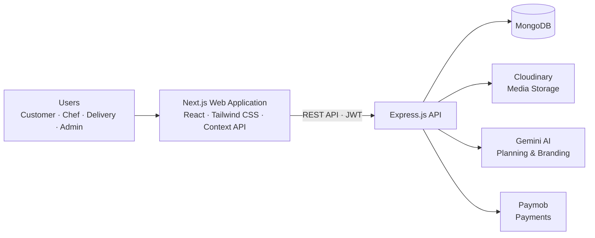

<div align="center">

# 🍽️ Sufra

### Bringing homemade food, local chefs, and seamless delivery together.

[](https://sufra-cloud-kitchen-nine.vercel.app/)
[](https://nextjs.org/)
[](https://react.dev/)
[](https://www.mongodb.com/)
[](https://tailwindcss.com/)

[Explore the live demo](https://sufra-cloud-kitchen-nine.vercel.app/) · [Report an issue](../../issues) · [Contribute](#-contributing)

</div>

---

## ✨ Overview

**Sufra** is an AI-powered cloud kitchen and homemade-food marketplace. It connects customers with talented home chefs and delivery personnel in one streamlined platform—making it easy to discover local meals, manage food businesses, and deliver orders reliably.

Built as an **ITI MEARN Stack Graduation Project**, Sufra provides dedicated, role-based experiences for customers, chefs, delivery personnel, and administrators.

## 🚀 Live Demo

Experience Sufra here: **[sufra-cloud-kitchen-nine.vercel.app](https://sufra-cloud-kitchen-nine.vercel.app/)**

## 🎯 Key Features

### 🌐 Public experience

- Browse meals, categories, and home chefs
- Search meals and view detailed meal pages
- Learn about the platform and get in touch through dedicated About and Contact pages

### 🧑‍🍳 Customer portal

- Secure authentication and personalized dashboard
- Cart, checkout, and payment workflow
- Order tracking and order history
- Favorites, reviews, and ratings
- In-app notifications
- AI-powered meal planner tailored to preferences and budget

### 👩‍🍳 Chef portal

- Authentication, onboarding, and verification workflow
- Kitchen dashboard with order and revenue insights
- Full meal management (create, read, update, and delete)
- Order management and earnings tracking
- AI chef branding assistant for kitchen identity and messaging
- Profile and notification management

### 🛵 Delivery portal

- Secure delivery-person authentication
- Delivery dashboard and current assigned order
- Delivery history and order-completion flow using customer OTP
- In-app notifications

### 🛡️ Admin portal

- Dashboard analytics and platform oversight
- Customer, chef, and delivery-person management
- Chef verification and meal moderation
- Category, contact, order, and withdrawal-request management
- Delivery assignment and notification management

### 🤖 AI capabilities

- **AI Meal Planner** — generates personalized meal plans from preferences, budget, and dietary needs
- **AI Chef Branding Assistant** — helps chefs create kitchen names, slogans, and descriptions
- **Smart Recommendations** — supports more relevant food discovery

## 🏗️ System Architecture



## 🧰 Tech Stack

| Layer | Technologies |
| --- | --- |
| Frontend | Next.js, React.js, Tailwind CSS, Context API |
| Backend | Node.js, Express.js |
| Database | MongoDB |
| Authentication | JWT, Google OAuth |
| Media Storage | Cloudinary |
| AI Services | Google Gemini AI |
| Payments | Paymob Payment Gateway |
| Deployment | Vercel |

## 📸 Screenshots

> Add your product screenshots to `public/screenshots/`, then replace the placeholders below with the matching image paths.

| Home & Discovery | Customer Dashboard |
| --- | --- |
| `public/screenshots/home.png` | `public/screenshots/customer-dashboard.png` |

| Chef Dashboard | Admin Dashboard |
| --- | --- |
| `public/screenshots/chef-dashboard.png` | `public/screenshots/admin-dashboard.png` |

## ⚙️ Installation & Setup

### Prerequisites

- Node.js 18 or later
- npm 9 or later
- A running Sufra backend API (local or deployed)
- Google OAuth client credentials for Google sign-in

### 1. Clone the repository

```bash
git clone https://github.com/<your-username>/sufra-cloud-kitchen.git
cd sufra-cloud-kitchen
```

### 2. Install dependencies

```bash
npm install
```

### 3. Configure environment variables

Create a `.env.local` file in the project root:

```env
NEXT_PUBLIC_API_BASE_URL=http://localhost:3000/api
NEXT_PUBLIC_GOOGLE_CLIENT_ID=your_google_oauth_client_id
```

### 4. Start the development server

```bash
npm run dev
```

Open [http://localhost:3000](http://localhost:3000) in your browser.

### Other commands

```bash
npm run lint    # Run ESLint
npm run build   # Create a production build
npm run start   # Serve the production build
```

## 🔐 Environment Variables

| Variable | Required | Description |
| --- | --- | --- |
| `NEXT_PUBLIC_API_BASE_URL` | Yes | Base URL of the Sufra REST API, including `/api` |
| `NEXT_PUBLIC_GOOGLE_CLIENT_ID` | Yes | Google OAuth client ID used by the login provider |

> Keep credentials and service secrets out of version control. Backend-only credentials for MongoDB, JWT, Cloudinary, Gemini, and Paymob belong in the backend environment—not in this client application.

## 📡 API Overview

The frontend consumes a REST API authenticated with JWT bearer tokens. The configured base URL is supplied through `NEXT_PUBLIC_API_BASE_URL`.

| Area | Example endpoints | Access |
| --- | --- | --- |
| Authentication | `/auth/register`, `/auth/login`, `/auth/google`, `/auth/me` | Public / authenticated |
| Meals & categories | `/meals`, `/categories/active` | Public / chef / admin |
| Shopping & orders | `/cart`, `/orders/checkout`, `/orders/my-orders` | Customer |
| Chef operations | `/chefs/profile`, `/settlement/wallet`, `/withdrawals/request` | Chef |
| AI services | `/meal-planning/generate`, `/chefs/kitchen-branding` | Customer / chef |
| Delivery | `/delivery/current-order`, `/delivery/orders/:orderId/complete` | Delivery |
| Administration | `/admin/delivery-management`, `/users/delivery`, `/verification-request` | Admin |

For the full endpoint reference, see [api.md](./api.md).

## 📁 Folder Structure

```text
src/
├── app/                 # Next.js App Router pages and route groups
│   ├── (admin)/         # Admin interface
│   ├── (auth)/          # Login, registration, and password flows
│   ├── (chef)/          # Chef portal
│   ├── (customer)/      # Customer portal
│   ├── (delivery)/      # Delivery portal
│   └── (public)/        # Public-facing pages
├── components/          # Reusable UI and feature components
├── context/             # Shared application state providers
├── guards/              # Authentication and role-based route guards
├── hooks/               # Custom React hooks
├── providers/           # App-level providers
├── schemas/             # Form validation schemas
├── services/            # API clients and service modules
└── utils/               # Shared utility functions
public/                  # Static assets
api.md                   # Backend API reference
```

## 🗺️ Future Enhancements

- Real-time delivery tracking and live order-status updates
- Advanced recommendation engine based on behavioral data
- Multi-language support and localization improvements
- Chef promotions, discount codes, and loyalty rewards
- Native mobile applications for customers and delivery personnel
- Automated delivery assignment and route optimization
- Expanded analytics for chefs and administrators

## 👥 Team

Sufra was developed by a team of developers as part of the **ITI MEARN Stack Graduation Project**.

| Role | Team Member |
| --- | --- |
| Team members | _Add team member names and GitHub profiles here_ |

## 🌍 Deployment

The frontend is deployed on **Vercel**.

- **Live application:** [Sufra Cloud Kitchen](https://sufra-cloud-kitchen-nine.vercel.app/)
- **Production configuration:** Set `NEXT_PUBLIC_API_BASE_URL` and `NEXT_PUBLIC_GOOGLE_CLIENT_ID` in your Vercel project environment variables.

## 🤝 Contributing

Contributions, ideas, and bug reports are welcome.

1. Fork the repository.
2. Create a branch: `git checkout -b feature/your-feature-name`.
3. Make and test your changes.
4. Commit with a clear message: `git commit -m "feat: add your feature"`.
5. Push your branch and open a pull request.

Please keep pull requests focused and describe the problem and solution clearly.

## 📄 License

This project is licensed under the [MIT License](./LICENSE).

---

<div align="center">
  Made with ❤️ for local food communities and home chefs.
</div>
